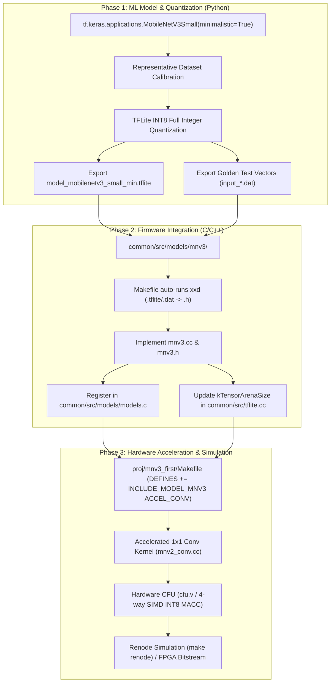

# MobileNetV3 Minimalistic Conversion Guide for CFU-Playground

This guide details the complete, step-by-step process for converting a project in **CFU-Playground** (such as `proj/mnv2_first`) to use **MobileNetV3-Minimalistic** with full integer (INT8) quantization and Custom Function Unit (CFU) hardware acceleration.

---

## 1. Executive Summary & Why MobileNetV3-Minimalistic

MobileNetV3 introduces Neural Architecture Search (NAS) and NetAdapt-optimized layer topologies, but standard MobileNetV3 variants include features that are challenging for embedded hardware accelerators:
* **Squeeze-and-Excitation (SE) Modules**: Require intermediate global pooling and two fully connected layers per block, causing significant memory ping-pong and control overhead.
* **`h-swish` / `h-sigmoid` Activations**: Piecewise non-linear functions that require lookup tables (LUTs) or division/multiplication hardware.

**MobileNetV3-Minimalistic** bridges this gap:
1. **Preserves NAS-optimized block structures and channels** (yielding higher accuracy and lower parameter counts than MobileNetV2).
2. **Removes all Squeeze-and-Excitation (SE) modules**.
3. **Replaces all `h-swish` activations with standard `ReLU6`**.
4. **Maintains 100% compatibility** with standard integer TFLite Micro kernels and CFU-Playground SIMD 1x1 Conv acceleration.

---

## 2. End-to-End System Workflow



---

## 3. Phase 1: Model Creation, INT8 Quantization & Test Vector Export

Run the following Python script to instantiate MobileNetV3-Small Minimalistic, calibrate it with an INT8 representative dataset, export the `.tflite` model, and generate binary test vectors:

```python
import numpy as np
import tensorflow as tf

# 1. Model Configuration
INPUT_SHAPE = (160, 160, 3) # Alternative resolutions: (96, 96, 3), (224, 224, 3)
ALPHA = 0.35                # Width multiplier: 0.35, 0.50, 0.75, 1.0
NUM_CLASSES = 2             # Adjust to your task (e.g. 2 for binary classification, 1000 for ImageNet)

# 2. Instantiate MobileNetV3-Small Minimalistic
model = tf.keras.applications.MobileNetV3Small(
    input_shape=INPUT_SHAPE,
    alpha=ALPHA,
    minimalistic=True,      # CRITICAL: Disables SE modules & uses ReLU6
    include_top=True,
    weights=None,           # Replace with pre-trained weights if available
    classes=NUM_CLASSES
)

# 3. Calibration Generator for Full Integer Quantization (PTQ)
def representative_dataset_gen():
    for _ in range(100):
        # Generate representative sample inputs in range [-1.0, 1.0]
        data = np.random.uniform(-1.0, 1.0, size=(1, *INPUT_SHAPE)).astype(np.float32)
        yield [data]

# 4. TFLite Converter INT8 Configuration
converter = tf.lite.TFLiteConverter.from_keras_model(model)
converter.optimizations = [tf.lite.Optimize.DEFAULT]
converter.representative_dataset = representative_dataset_gen
converter.target_spec.supported_ops = [tf.lite.OpsSet.TFLITE_BUILTINS_INT8]
converter.inference_input_type = tf.int8
converter.inference_output_type = tf.int8

tflite_model_quant = converter.convert()

# 5. Save Flatbuffer Model
model_filename = "model_mobilenetv3_small_min.tflite"
with open(model_filename, "wb") as f:
    f.write(tflite_model_quant)
print(f"Saved: {model_filename}")

# 6. Generate Sample Golden Test Input (.dat)
interpreter = tf.lite.Interpreter(model_content=tflite_model_quant)
interpreter.allocate_tensors()
input_details = interpreter.get_input_details()
output_details = interpreter.get_output_details()

sample_input = np.random.randint(-128, 127, size=input_details[0]['shape'], dtype=np.int8)
sample_input.tofile("input_00001.dat")

interpreter.set_tensor(input_details[0]['index'], sample_input)
interpreter.invoke()
expected_output = interpreter.get_tensor(output_details[0]['index'])

print(f"Sample test vector saved to input_00001.dat")
print(f"Expected Output: {expected_output}")
```

---

## 4. Phase 2: Firmware Integration (`common/src/models/`)

### 1. Create Model Directory
Create the folder `common/src/models/mnv3/` and copy the generated files:
* `model_mobilenetv3_small_min.tflite`
* `input_00001.dat`

The CFU-Playground Makefile automatically compiles any `.tflite` and `.dat` file into C headers (`.h`) containing byte arrays and length variables.

### 2. Create Header: `common/src/models/mnv3/mnv3.h`
```c
/*
 * Copyright 2026 The CFU-Playground Authors
 */
#ifndef _MNV3_H
#define _MNV3_H

#ifdef __cplusplus
extern "C" {
#endif

void mnv3_menu(void);

#ifdef __cplusplus
}
#endif

#endif  // _MNV3_H
```

### 3. Create Source: `common/src/models/mnv3/mnv3.cc`
```cpp
/*
 * Copyright 2026 The CFU-Playground Authors
 */
#include "models/mnv3/mnv3.h"

#include <stdio.h>
#include "menu.h"
#include "models/mnv3/input_00001.h"
#include "models/mnv3/model_mobilenetv3_small_min.h"
#include "tflite.h"

#ifdef CSR_VIDEO_FRAMEBUFFER_BASE
extern "C" {
#include "fb_util.h"
};
#endif

// Initialize the model in TFLM
static void mnv3_init(void) {
  tflite_load_model(model_mobilenetv3_small_min, model_mobilenetv3_small_min_len);
}

// Run classification
static int32_t mnv3_classify(void) {
  printf("Running MobileNetV3 Minimalistic...\n");
  tflite_classify();

  int8_t* output = tflite_get_output();
  // Adjust logit indexing based on number of output classes
  return (int32_t)output[1] - (int32_t)output[0];
}

static void do_classify_zeros(void) {
  tflite_set_input_zeros();
  int32_t result = mnv3_classify();
  printf("Result with zeros: %ld\n", (long)result);
}

static void do_classify_test0(void) {
  tflite_set_input_unsigned(input_00001);
  int32_t result = mnv3_classify();
  printf("Result for Test 0: %ld\n", (long)result);

#ifdef CSR_VIDEO_FRAMEBUFFER_BASE
  char msg_buff[256] = {0};
  snprintf(msg_buff, sizeof(msg_buff), "Result: %ld", (long)result);
  fb_clear();
  fb_draw_string(0, 10, 0x007FFF00, "MobileNetV3 Min Test 0");
  fb_draw_buffer(0, 50, 160, 160, (const uint8_t*)input_00001, 3);
  fb_draw_string(0, 220, 0x007FFF00, msg_buff);
  flush_cpu_dcache();
  flush_l2_cache();
#endif
}

static struct Menu MENU = {
    "Tests for MobileNetV3 Minimalistic",
    "mnv3",
    {
        MENU_ITEM('0', "Run test 0", do_classify_test0),
        MENU_ITEM('z', "Run with zeros input", do_classify_zeros),
        MENU_END,
    },
};

void mnv3_menu(void) {
  mnv3_init();

#ifdef CSR_VIDEO_FRAMEBUFFER_BASE
  fb_init();
  flush_cpu_dcache();
  flush_l2_cache();
#endif

  menu_run(&MENU);
}
```

### 4. Register in `common/src/models/models.c` and `common/src/models/models.h`
In `common/src/models/models.h`:
```c
#include "models/mnv3/mnv3.h"
```

In `common/src/models/models.c`:
```c
#if defined(INCLUDE_MODEL_MNV3)
        MENU_ITEM(AUTO_INC_CHAR, "MobileNetV3 Minimalistic model", mnv3_menu),
#endif
```

### 5. Update Tensor Arena in `common/src/tflite.cc`
Ensure `kTensorArenaSize` accommodates the peak activation tensors for MobileNetV3:
```cpp
constexpr int kTensorArenaSize = const_max<int>(
#ifdef INCLUDE_MODEL_MNV3
    800 * 1024,
#endif
#ifdef INCLUDE_MODEL_MNV2
    800 * 1024,
#endif
...
```

---

## 5. Phase 3: Hardware Acceleration & Kernel Co-Design

### 1. 1x1 Convolution Offloading
In MobileNetV3 Minimalistic, **1x1 Pointwise Convolutions** account for **>85% of total MACCs**. 

The existing integer convolution kernel in `proj/mnv2_first/src/tensorflow/lite/kernels/internal/reference/integer_ops/conv.cc` intercepts 1x1 convolutions and dispatches them to `Mnv2ConvPerChannel1x1()`:

```cpp
#ifdef ACCEL_CONV
  if (pad_width == 0 && pad_height == 0 && dilation_width_factor == 1 &&
      dilation_height_factor == 1 &&
      output_activation_min == -128 && output_activation_max == 127 &&
      batches == 1) {
    if (params.stride_width == 1 && params.stride_height == 1 &&
        input_height == output_height && input_width == output_width &&
        filter_height == 1 && filter_width == 1 && bias_data &&
        input_depth < MAX_CONV_INPUT_VALUES && (input_depth % 8) == 0 &&
        (output_depth % 8) == 0) {
      Mnv2ConvPerChannel1x1(params, output_multiplier, output_shift,
                            input_shape, input_data, filter_shape, filter_data,
                            bias_shape, bias_data, output_shape, output_data);
      return;
    }
  }
#endif
```

### 2. Channel Alignment Consideration
* The accelerated kernel expects `input_depth` and `output_depth` to be multiples of 8.
* When configuring MobileNetV3 channels (via `alpha`), ensure layer channels are multiples of 8 for maximum hardware acceleration coverage.
* Any unaligned layers safely fall back to the standard C++ reference convolution loop without error.

### 3. CFU Gateware (`cfu.v`) Compatibility
The Verilog CFU in `proj/mnv2_first/cfu.v` provides:
* **4-Way SIMD INT8 dot products**: Multiplies four 8-bit weights and inputs in a single cycle.
* **On-chip weight/bias buffering**: Caches filter weights and bias parameters in hardware registers.
* **Hardware post-quantization**: Computes multiplier scaling, fixed-point rounding shift, and `[-128, 127]` clamping in hardware.

Because the underlying arithmetic for 1x1 convolutions is identical between MobileNetV2 and MobileNetV3 Minimalistic, `cfu.v` requires **no structural gateware changes**.

---

## 6. Phase 4: Build, Simulation & Verification

### 1. Configure Project Makefile
In `proj/mnv2_first/Makefile` (or your dedicated `proj/mnv3_first/Makefile`):
```makefile
# Include MobileNetV3 model
DEFINES += INCLUDE_MODEL_MNV3

# Enable CFU Hardware 1x1 Conv Acceleration
DEFINES += ACCEL_CONV

# Set default interactive test menu item
RUN_MENU_ITEMS := 3 1
```

### 2. Compile Target Software
```bash
cd proj/mnv2_first
make clean
make -j$(nproc)
```

### 3. Run Renode Simulation
```bash
make renode
```
In the Renode terminal:
1. Choose menu option `1` (TfLM Models).
2. Choose the menu option for **MobileNetV3 Minimalistic model**.
3. Select `0` to execute Test 0 or `z` to execute with zeros input.
4. Verify cycle counts and prediction output.

---

## 7. Troubleshooting & Verification Checklist

| Symptom / Issue | Root Cause | Solution |
| :--- | :--- | :--- |
| `AllocateTensors() failed` | Tensor arena too small | Increase arena size in `common/src/tflite.cc` (`kTensorArenaSize`). |
| `Unsupported Op: HARD_SWISH` or `MUL` | Model was not exported as minimalistic | Ensure `minimalistic=True` in `tf.keras.applications.MobileNetV3Small()`. |
| Inference accuracy is degraded | Calibration dataset not representative | Use real representative domain images in `representative_dataset_gen()`. |
| 1x1 Conv layers not accelerating | Channel depths not divisible by 8 | Select an `alpha` value that produces channel dimensions divisible by 8. |
