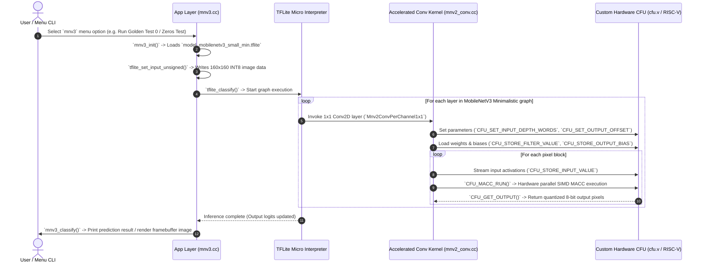

# MobileNetV3 Minimalistic Execution Flow in CFU-Playground

This document details the complete end-to-end execution flow of **MobileNetV3 Minimalistic** within the **CFU-Playground** hardware/software co-design framework (`proj/mnv2_first`).

---

## 1. Overview & Architecture

CFU-Playground accelerates neural network inference on RISC-V SoCs implemented on FPGAs (or simulated using Renode).

In **MobileNetV3 Minimalistic**, Neural Architecture Search (NAS) discovers layer topologies that deliver higher accuracy per parameter than MobileNetV2. Over **85% of total inference time** is spent in **1x1 Pointwise Convolutions**.

By utilizing `minimalistic=True`:
1. **Squeeze-and-Excitation (SE) modules are disabled** (avoiding intermediate global pooling and dense layer memory overhead).
2. **`h-swish` activations are replaced with `ReLU6`** (allowing standard INT8 quantization).
3. **100% Hardware Compatibility**: 1x1 Pointwise Convolutions are offloaded to the 4-way SIMD Multiply-Accumulate (MACC) hardware Custom Function Unit ([`cfu.v`](file:///home/victus_linux/cfu-playground-fork/CFU-Playground/proj/mnv2_first/cfu.v)).

---

## 2. System Execution Flow Diagram



---

## 3. Step-by-Step Component Breakdown

### Step 1: Model Export & Application Initialization
* **Source Files**: 
  * [`common/src/models/mnv3/generate_mnv3_model.py`](file:///home/victus_linux/cfu-playground-fork/CFU-Playground/common/src/models/mnv3/generate_mnv3_model.py)
  * [`common/src/models/mnv3/mnv3.cc`](file:///home/victus_linux/cfu-playground-fork/CFU-Playground/common/src/models/mnv3/mnv3.cc)
  * [`common/src/models/mnv3/model_mobilenetv3_small_min.h`](file:///home/victus_linux/cfu-playground-fork/CFU-Playground/common/src/models/mnv3/model_mobilenetv3_small_min.h)
* **Actions**:
  1. `generate_mnv3_model.py` uses `tf.keras.applications.MobileNetV3Small(minimalistic=True)` to produce the quantized INT8 `.tflite` model and golden test vector (`input_00001.dat`).
  2. The Makefile auto-compiles `.tflite` and `.dat` files into C header byte arrays (`model_mobilenetv3_small_min.h` and `input_00001.h`).
  3. `mnv3_menu()` initializes the menu and calls `mnv3_init()`.
  4. `mnv3_init()` passes the binary flatbuffer array to `tflite_load_model()`.
  5. The user selects a test (e.g. `do_classify_test0()`), which calls `tflite_set_input_unsigned(input_00001)` to load the input tensor.

---

### Step 2: TensorFlow Lite Micro (TFLM) Execution Engine
* **Source Files**: `third_party/tflite-micro/`, [`common/src/tflite.cc`](file:///home/victus_linux/cfu-playground-fork/CFU-Playground/common/src/tflite.cc)
* **Actions**:
  1. `mnv3_classify()` calls `tflite_classify()` to start execution.
  2. Memory is allocated from the pre-allocated tensor arena (`kTensorArenaSize = 800 * 1024` bytes).
  3. The TFLite Micro interpreter walks the MobileNetV3 Minimalistic execution graph layer by layer (3x3 Depthwise Convolutions, 1x1 Pointwise Convolutions, ReLU6 Activations, Global Average Pooling).
  4. When encountering a 1x1 Conv2D layer with aligned input/output depths ($InputDepth \% 8 == 0$), execution is dispatched to the accelerated kernel `Mnv2ConvPerChannel1x1()`.

---

### Step 3: Accelerated Reference Conv Kernel
* **Source File**: [`proj/mnv2_first/src/tensorflow/lite/kernels/internal/reference/integer_ops/mnv2_conv.cc`](file:///home/victus_linux/cfu-playground-fork/CFU-Playground/proj/mnv2_first/src/tensorflow/lite/kernels/internal/reference/integer_ops/mnv2_conv.cc)
* **Actions**:
  1. **Batched Channel Breakdown**: `CalculateChannelsPerBatch()` chunks large output channel depths to fit inside hardware local memory buffers.
  2. **Configuration Stream**: Sends layer parameters via custom RISC-V macros:
     * `CFU_SET_INPUT_DEPTH_WORDS(input_depth_words)`
     * `CFU_SET_OUTPUT_DEPTH(output_depth)`
     * `CFU_SET_INPUT_OFFSET(input_offset)`
     * `CFU_SET_OUTPUT_OFFSET(output_offset)`
  3. **Weight & Bias Stream**: Streams filter weights, multipliers, shifts, and biases into CFU hardware registers (`CFU_STORE_FILTER_VALUE()`, `CFU_STORE_OUTPUT_BIAS()`).
  4. **Pixel Execution Loop**:
     * Streams 4-byte packed uint32 input feature words using `CFU_STORE_INPUT_VALUE()`.
     * Invokes `CFU_MACC_RUN()` to execute 4-way SIMD hardware dot products.
     * Unloads calculated output pixels via `CFU_GET_OUTPUT()`.

---

### Step 4: Custom Function Unit (CFU) Hardware Layer
* **Source Files**: 
  * [`proj/mnv2_first/cfu.v`](file:///home/victus_linux/cfu-playground-fork/CFU-Playground/proj/mnv2_first/cfu.v) (Verilog FPGA HDL)
  * [`proj/mnv2_first/src/software_cfu.cc`](file:///home/victus_linux/cfu-playground-fork/CFU-Playground/proj/mnv2_first/src/software_cfu.cc) (Software Emulation)
* **Actions**:
  1. Intercepts custom RISC-V instructions (`cfu_op(...)`).
  2. Executes 4 parallel 8-bit integer multiplications per clock cycle (SIMD).
  3. Performs fixed-point per-channel quantization scaling (bias addition, scaling multiplication, right shift, and clamping to `[-128, 127]`).
  4. Writes outputs back to RISC-V CPU registers/memory.

---

### Step 5: Post-Processing & Output Visualization
* **Source File**: [`common/src/models/mnv3/mnv3.cc`](file:///home/victus_linux/cfu-playground-fork/CFU-Playground/common/src/models/mnv3/mnv3.cc)
* **Actions**:
  1. `tflite_get_output()` retrieves classification output logits.
  2. `mnv3_classify()` calculates prediction score difference and logs it to UART console.
  3. If video display framebuffer hardware (`CSR_VIDEO_FRAMEBUFFER_BASE`) is present, draws the test image and label directly to the monitor framebuffer.

---

## 4. Summary of Key Files Changed for MobileNetV3

| File | Purpose / Description |
| :--- | :--- |
| **[`generate_mnv3_model.py`](file:///home/victus_linux/cfu-playground-fork/CFU-Playground/common/src/models/mnv3/generate_mnv3_model.py)** | Python script to generate MobileNetV3 Minimalistic INT8 `.tflite` flatbuffer and test vectors. |
| **[`mnv3.h`](file:///home/victus_linux/cfu-playground-fork/CFU-Playground/common/src/models/mnv3/mnv3.h)** | Header file declaring `mnv3_menu()` interface. |
| **[`mnv3.cc`](file:///home/victus_linux/cfu-playground-fork/CFU-Playground/common/src/models/mnv3/mnv3.cc)** | C++ application handling model init, classification, and CLI menu. |
| **[`models.c`](file:///home/victus_linux/cfu-playground-fork/CFU-Playground/common/src/models/models.c)** | Registered `mnv3_menu` item in global TfLM models menu under `INCLUDE_MODEL_MNV3`. |
| **[`tflite.cc`](file:///home/victus_linux/cfu-playground-fork/CFU-Playground/common/src/tflite.cc)** | Configured `kTensorArenaSize = 800 * 1024` for MobileNetV3 activation memory. |
| **[`Makefile`](file:///home/victus_linux/cfu-playground-fork/CFU-Playground/proj/mnv2_first/Makefile)** | Added `DEFINES += INCLUDE_MODEL_MNV3` build flag. |

---

## 5. How to Build & Run MobileNetV3 Minimalistic

### Quick Run Commands (Terminal / Headless Simulation)

To run MobileNetV3 Minimalistic directly in headless terminal mode:

```bash
export PATH=/home/victus_linux/cfu-playground-fork/CFU-Playground/env/conda/envs/cfu-common/bin:$PATH
cd /home/victus_linux/cfu-playground-fork/CFU-Playground/proj/mnv2_first
make renode-headless
```

---

### Complete Build & Simulation Workflow

Follow these step-by-step instructions to generate the model, build the firmware, and run simulation in Renode:

#### Prerequisite 1: Set Up Python & Toolchain Environment
Ensure the Conda environment (containing `yosys` and `tensorflow`) is added to PATH:
```bash
export PATH=/home/victus_linux/cfu-playground-fork/CFU-Playground/env/conda/envs/cfu-common/bin:$PATH
```

#### Prerequisite 2: (Optional) Regenerate MobileNetV3 Model Asset
To generate a new quantized INT8 flatbuffer and test input vector:
```bash
python common/src/models/mnv3/generate_mnv3_model.py
```

#### Step 1: Configure Project Makefile
Ensure `proj/mnv2_first/Makefile` defines `INCLUDE_MODEL_MNV3` and `ACCEL_CONV`:
```makefile
DEFINES += INCLUDE_MODEL_MNV3
DEFINES += ACCEL_CONV
```

#### Step 2: Build Firmware & Verilate Hardware CFU
Clean previous build artifacts and compile the project binary:
```bash
# Navigate to the project directory
cd /home/victus_linux/cfu-playground-fork/CFU-Playground/proj/mnv2_first

# Clean build directory
make clean

# Compile firmware and verilate CFU hardware (multi-threaded)
make -j$(nproc)
```

#### Step 3: Run Renode Emulation & Interactive Console
Launch the Renode RISC-V SoC emulator in terminal mode:
```bash
make renode-headless
```

In the interactive UART console:
1. Type `1` to open **TfLM Models Menu**.
2. Type the corresponding menu key for **MobileNetV3 Minimalistic models**.
3. Select an execution test:
   * Press `g` to run **Golden test input 0**.
   * Press `z` to run **Zeros input test**.
