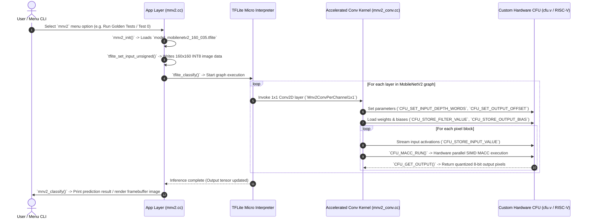

# MobileNetV2 Execution Flow in CFU-Playground

This document details the complete end-to-end execution flow of **MobileNetV2** within the **CFU-Playground** hardware/software co-design framework (`proj/mnv2_first`).

---

## 1. Overview & Architecture

CFU-Playground accelerates neural network inference on RISC-V SoCs implemented on FPGAs (or simulated using Renode). 

In MobileNetV2, over **90% of total inference time** is spent in **1x1 Pointwise Convolutions**. To achieve maximum hardware acceleration, CFU-Playground replaces the standard TFLite Micro nested loop convolution kernel with a specialized, hardware-accelerated integer convolution kernel that offloads 4-way SIMD Multiply-Accumulate (MACC) calculations directly to a Custom Function Unit (CFU).

---

## 2. System Execution Flow Diagram

---

## 3. Step-by-Step Component Breakdown

### Step 1: Application Layer & Model Initialization
* **Source Files**: 
  * [`common/src/models/mnv2/mnv2.cc`](file:///home/victus_linux/cfu-playground-fork/CFU-Playground/common/src/models/mnv2/mnv2.cc)
  * [`common/src/models/mnv2/model_mobilenetv2_160_035.tflite`](file:///home/victus_linux/cfu-playground-fork/CFU-Playground/common/src/models/mnv2/model_mobilenetv2_160_035.tflite)
* **Actions**:
  1. `mnv2_menu()` initializes the menu and calls `mnv2_init()`.
  2. `mnv2_init()` passes the binary flatbuffer model (`model_mobilenetv2_160_035.tflite`) to `tflite_load_model()`.
  3. The user triggers an inference test (e.g., `do_classify_0()` or `do_golden_tests()`).
  4. `tflite_set_input_unsigned()` populates the input tensor with 160x160x3 INT8 image data.

---

### Step 2: TensorFlow Lite Micro (TFLM) Execution Engine
* **Source Files**: `third_party/tflite-micro/`
* **Actions**:
  1. `mnv2_classify()` calls `tflite_classify()` to start execution.
  2. The TFLite Micro interpreter walks the MobileNetV2 graph operator by operator (Depthwise 3x3 Convolutions, Pointwise 1x1 Convolutions, Inverted Residual Additions, Global Average Pooling).
  3. When encountering a 1x1 Conv2D layer, TFLM dispatches execution to the overloaded reference kernel `Mnv2ConvPerChannel1x1()`.

---

### Step 3: Accelerated Reference Conv Kernel
* **Source File**: [`proj/mnv2_first/src/tensorflow/lite/kernels/internal/reference/integer_ops/mnv2_conv.cc`](file:///home/victus_linux/cfu-playground-fork/CFU-Playground/proj/mnv2_first/src/tensorflow/lite/kernels/internal/reference/integer_ops/mnv2_conv.cc)
* **Actions**:
  1. **Batched Channel Calculation**: `CalculateChannelsPerBatch()` breaks down large output channel depths into hardware-friendly batches to fit inside CFU local memory buffers.
  2. **Configuration Stream**: Sends layer parameters to hardware via custom RISC-V CFU macros:
     * `CFU_SET_INPUT_DEPTH_WORDS(input_depth_words)`
     * `CFU_SET_OUTPUT_DEPTH(output_depth)`
     * `CFU_SET_INPUT_OFFSET(input_offset)`
     * `CFU_SET_OUTPUT_OFFSET(output_offset)`
     * `CFU_SET_ACTIVATION_MIN(...)` / `CFU_SET_ACTIVATION_MAX(...)`
  3. **Weight & Bias Stream**: Streams 32-bit packed filter words, scale multipliers, shifts, and biases into hardware registers using `CFU_STORE_FILTER_VALUE()`, `CFU_STORE_OUTPUT_MULTIPLIER()`, and `CFU_STORE_OUTPUT_BIAS()`.
  4. **Pixel Execution Loop**:
     * Streams 4-byte packed uint32 input feature words using `CFU_STORE_INPUT_VALUE()`.
     * Executes `CFU_MACC_RUN()` to perform hardware-accelerated multiply-accumulates.
     * Unloads calculated output pixels using `UnloadOutputValues()` (`CFU_GET_OUTPUT()`).

---

### Step 4: Custom Function Unit (CFU) Hardware Layer
* **Source Files**: 
  * [`proj/mnv2_first/cfu.v`](file:///home/victus_linux/cfu-playground-fork/CFU-Playground/proj/mnv2_first/cfu.v) (Verilog FPGA HDL)
  * [`proj/mnv2_first/src/software_cfu.cc`](file:///home/victus_linux/cfu-playground-fork/CFU-Playground/proj/mnv2_first/src/software_cfu.cc) (Software Emulation)
* **Actions**:
  1. Intercepts RISC-V custom instructions (`cfu_op(...)`).
  2. Performs 4 parallel 8-bit integer multiplications per cycle (SIMD).
  3. Performs fixed-point per-channel quantization scaling (bias addition, scaling multiplication, right shift, and clamping to `[-128, 127]`).
  4. Returns the result directly to CPU registers/memory.

---

### Step 5: Post-Processing & Output Visualization
* **Source File**: [`common/src/models/mnv2/mnv2.cc`](file:///home/victus_linux/cfu-playground-fork/CFU-Playground/common/src/models/mnv2/mnv2.cc)
* **Actions**:
  1. `tflite_get_output()` retrieves the calculated classification logits.
  2. `mnv2_classify()` computes the top prediction score and logs it to UART console.
  3. If video display framebuffer hardware (`CSR_VIDEO_FRAMEBUFFER_BASE`) is present, it draws the test image and classification label onto the screen display.

---

## 4. Key Performance Optimizations

1. **SIMD Packing**: Operates on 4 INT8 values packed into 32-bit RISC-V words, quadrupling memory bandwidth efficiency.
2. **On-Chip Weight Buffering**: Filter weights and quantization parameters are loaded once per batch into internal CFU registers, eliminating repeated memory fetch latency during spatial loops.
3. **Hardware Fixed-Point Quantization**: Offloads bias addition, multiplier scaling, and clamping directly into Verilog hardware pipelines.
